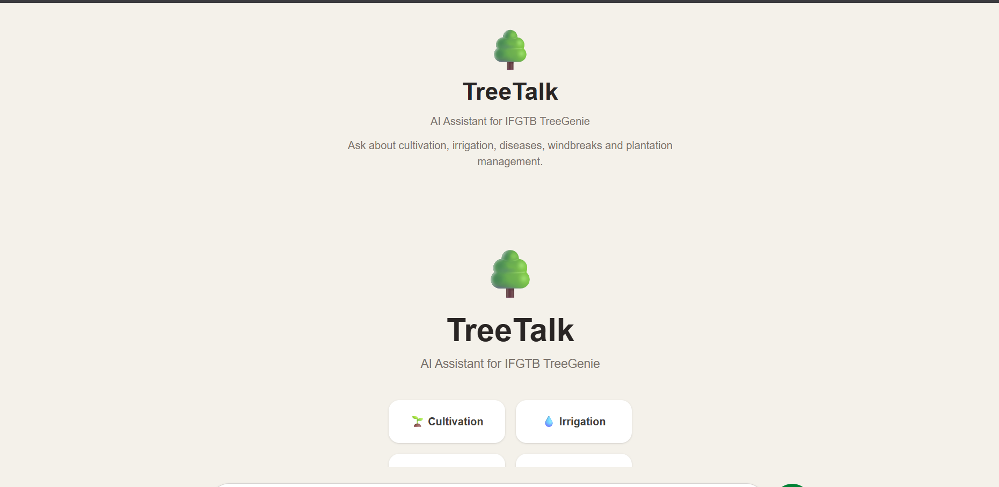
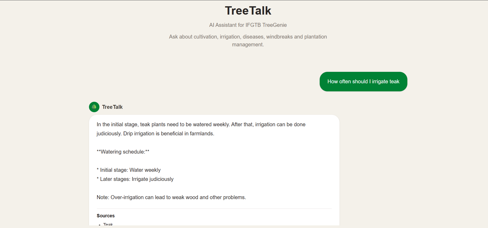

# 🌳 TreeTalk

> **AI-powered Forestry Assistant built using Retrieval-Augmented Generation (RAG)**

TreeTalk is an AI-powered assistant that answers forestry-related questions using advisory documents from the IFGTB TreeGenie knowledge base. It combines semantic search with a local Large Language Model (LLM) to provide concise, source-backed answers through an interactive web interface.

---

## ✨ Features

- 🌳 Ask natural language questions about forestry and tree cultivation
- 🔍 Retrieval-Augmented Generation (RAG) using ChromaDB
- 🧠 Local LLM inference using **Ollama (Llama 3.1)**
- 📚 Source-backed answers from TreeGenie advisory documents
- ⚡ FastAPI backend with REST API
- 💻 Modern Next.js + React frontend
- 🎨 Responsive UI built with Tailwind CSS

---

## 🏗️ System Architecture

```text
                    User
                      │
                      ▼
          Next.js + React Frontend
                      │
              HTTP REST API
                      │
                      ▼
               FastAPI Backend
                      │
                      ▼
          Retrieval (LangChain RAG)
                      │
        Semantic Search (ChromaDB)
                      │
      HuggingFace Embeddings (BGE)
                      │
                      ▼
          Ollama (Llama 3.1 8B)
                      │
                      ▼
             AI Generated Answer
                      │
                      ▼
               Response + Sources
```

---

## 🛠️ Tech Stack

### Frontend

- Next.js
- React
- TypeScript
- Tailwind CSS

### Backend

- Python
- FastAPI
- LangChain
- ChromaDB
- HuggingFace Embeddings
- Ollama
- Llama 3.1

### Knowledge Base

- TreeGenie Advisory Markdown Documents

---

## 📁 Project Structure

```
TreeTalk
│
├── backend
│   ├── data
│   ├── src
│   ├── chroma
│   └── requirements.txt
│
├── frontend
│   ├── src
│   ├── public
│   └── package.json
│
├── screenshots
│
├── README.md
└── .gitignore
```

---

## 🚀 Getting Started

### 1. Clone the repository

```bash
git clone https://github.com/<your-username>/TreeTalk.git

cd TreeTalk
```

---

### 2. Backend Setup

```bash
cd backend

python -m venv venv

# Windows
venv\Scripts\activate

python -m pip install -r requirements.txt
```

---

### 3. Generate the Vector Database

```bash
python -m src.ingest
```

---

### 4. Start the Backend

```bash
python -m uvicorn src.api:app --reload
```

Backend runs at:

```
http://localhost:8000
```

Swagger documentation:

```
http://localhost:8000/docs
```

---

### 5. Frontend Setup

```bash
cd frontend

npm install

npm run dev
```

Frontend runs at:

```
http://localhost:3000
```

---

## 📸 Screenshots

### Landing Page

> *(Add `screenshots/landing.png` here)*

```markdown

```

---

### Chat Interface

> *(Add `screenshots/chat.png` here)*

```markdown

```

---

## 💡 Example Questions

- How often should I irrigate teak?
- What soil is suitable for tamarind?
- Which fertilizer is recommended for neem?
- What are the common diseases affecting teak?
- How should eucalyptus plantations be managed?

---

## 🔮 Future Improvements

- 🎤 Voice Assistant
- 🌐 Multilingual Support (Tamil)
- 📷 Image-based Disease Detection
- 💬 Conversational Memory
- ☁️ Cloud Deployment
- 📱 Mobile Application
- 📊 Better Source Visualization
- 🌳 Expanded Tree Knowledge Base

---

## 📖 About the Project

TreeTalk demonstrates how Retrieval-Augmented Generation (RAG) can be used to build a domain-specific AI assistant for forestry. Instead of relying solely on the language model's internal knowledge, the system retrieves relevant information from TreeGenie advisory documents and generates grounded, source-backed responses.

This project was developed as an educational AI application to explore modern LLM, vector database, and semantic search workflows.

---

## 📜 License

This project is released under the MIT License.
